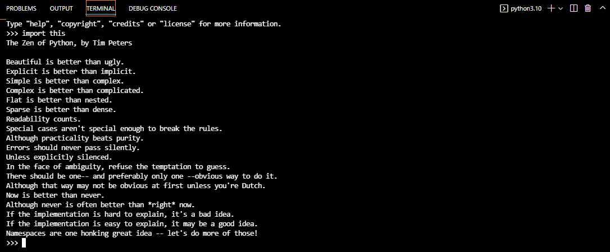

# Conclusiones

## Python 2 vs python 3
Python 3 tiene más demanda e incluye un sistema de escritura. Python 2 está desactualizado y usa una sintaxis más antigua para la función de impresión. Si bien Python 2 todavía se usa para la gestión de configuración en DevOps, Python 3 es el estándar actual. Python (el código, no la serpiente) es un lenguaje de codificación popular para aprender para principiantes.

### -----------------------------------------------------------------------------------------------------
# PEPS
Es la forma en que se define como avanza el lenguaje, indica cuales son los cambios del lenguaje, cambios de la organización o cambios de las buenas prácticas. 

- PEP8 = guía de estilo de como escribir programas de python 
- PEP257 = explica como generar buena comunicación en nuesro código
- PEP20 = import this (ejecutar en la consola)

### -----------------------------------------------------------------------------------------------------

## PEP20: The Zen of Python, by Tim Peters

