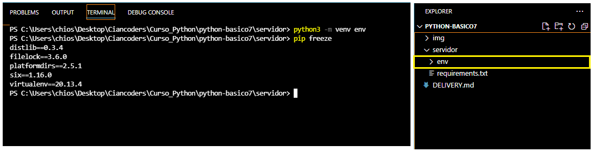
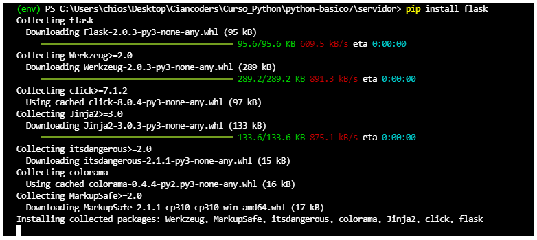
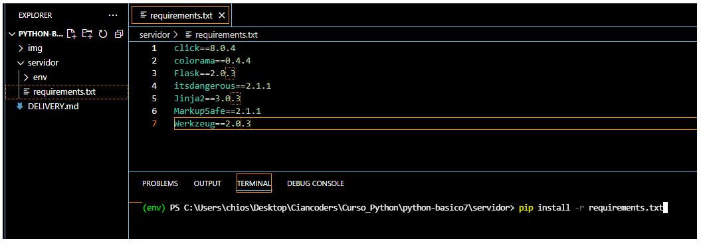
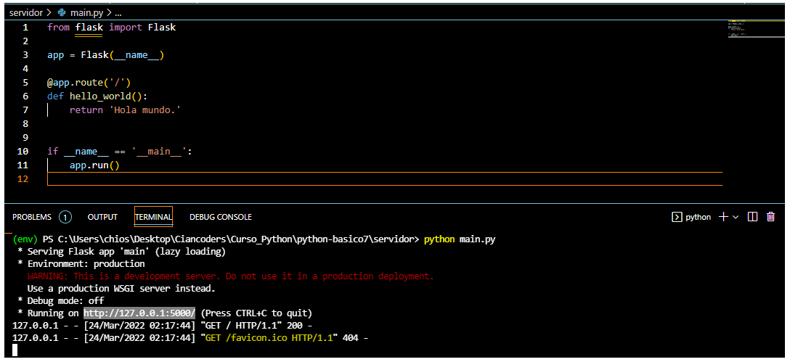
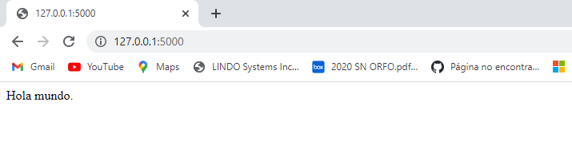

# Paquetes de terceros

Pypi, repositorio de paquetes de terceros que se pueden utilizar en proyecto de python, para instalarlos se debe de utilizar la herramienta pip. 

Commando para instalar un paquete:
- pip install NombrePaquete

 ## -----------------------------------------------------------------------------------------------

# Ambiente Virtual

Es una buena práctica crear un ambiente virtual por cada proyecto de Python, esto evita conflictos de paquetes en el intérprete principal

Commados: 
- pip install virtualenv (intalación)
- python3 -m venv NombreInterpreteVirtual (crear el entorno virtual)
- ./NombreInterpreteVirtual/Scripts/Activate (para activar)
 - deactivete (sirve para desactivar)

 ## -----------------------------------------------------------------------------------------------

 # Uso de entorno virtual

 ## - Creación de carpeta del entorno virtual

 ## - Instalación de Flaks

 ## - Creación de archivo requirements.txt 
 

 ## - Ejecución del servidor 

